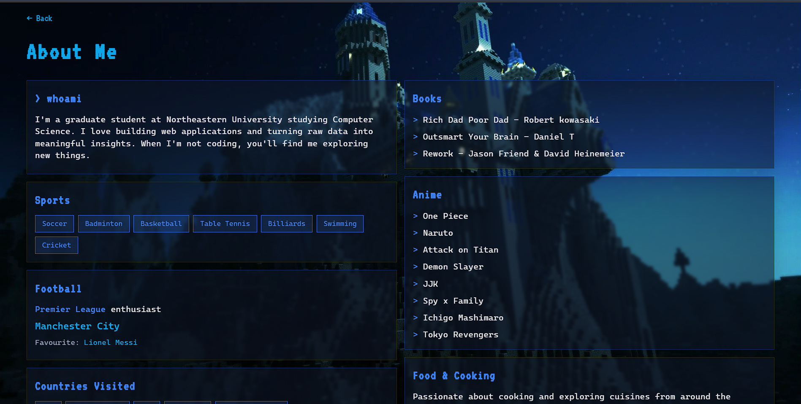

# Mohammed Armaan - Personal Homepage

A modern, responsive personal portfolio website showcasing my journey as a graduate student and full-stack developer. Built with vanilla HTML, CSS, and JavaScript with a sleek dark theme and interactive elements.


<!-- Replace with an actual screenshot or GIF of your site -->

##  Project Objective

This project serves as my personal homepage and portfolio to:
- Showcase my work experience, projects, and technical skills
- Provide a central hub for professional connections (GitHub, LinkedIn, Email)
- Express my personality through design choices and interactive elements
- Demonstrate frontend development capabilities with pure HTML/CSS/JS

## Features

- **Dark Theme Design** - Sleek black background with aquamarine accents
- **Interactive Experience Cards** - Hover to reveal job details with smooth animations
- **Tech Stack Showcase** - Hover over technologies to see their logos
- **News Ticker** - Auto-scrolling ticker with fun personal facts
- **Twinkling Links** - Random highlight effect on navigation links
- **Project Cards** - Expandable cards showing tech tags on hover
- **About Me Page** - Minecraft-themed secondary page with personal interests
- **Memory Game** - Interactive memory matching game
- **Photo Album** - Personal photo gallery page
- **Fully Responsive** - Works on desktop, tablet, and mobile devices

##  Screenshots

| Home Page | About Page |
|-----------|------------|
|  |  |

<!-- Replace with actual screenshots -->

##  Tech Requirements

- **HTML5** - Semantic markup structure
- **CSS3** - Custom styling with CSS variables, flexbox, grid
- **JavaScript (ES6+)** - DOM manipulation, event handling, animations
- **Bootstrap 5.3.8** - Grid system and utility classes
- **Font Awesome 6.4.0** - Icons
- **Google Fonts** - Cascadia Mono, VT323 (for Minecraft theme)

##  Project Structure

```
personal/
├── index.html                  # Main homepage
├── package.json                # Project configuration
├── Design_document.pdf         # Design documentation
├── README.md                   # Project documentation
├── images/
│   ├── Boston/                 # Boston-related images
│   ├── favicon.ico             # Site favicon
│   ├── luffyone.png            # Luffy decoration
│   ├── luffyopengraph.png      # Open Graph image
│   ├── mangapanel.png          # One Piece panel
│   ├── minecraftbg.jpg         # Minecraft background (JPG)
│   ├── minecraftbg.png         # Minecraft background (PNG)
│   ├── photo.png               # Profile photo
│   ├── python.png              # Python logo
│   └── thumbnail.png           # Thumbnail image
├── js/
│   ├── memorygame.js           # Memory game functionality
│   └── script.js               # Main interactive functionality
├── pages/
│   ├── aboutme.html            # About me page
│   └── album.html              # Photo album page
└── styles/
    ├── aboutstyle.css          # About page styles
    ├── albumstyle.css          # Album page styles
    ├── homestyle.css           # Main page styles
    └── memorygamestyle.css     # Memory game styles
```

##  Design Document

View the design document for this project: [Design_document.pdf](https://github.com/mohammedarmaan/personal/blob/main/Design_document.pdf)

##  How to Install / Use

### Option 1: Clone and Open
```bash
# Clone the repository
git clone https://github.com/mohammedarmaan/personal.git

# Navigate to the project directory
cd personal

# Open in browser
open index.html
# or simply double-click index.html
```

### Option 2: Live Server (Recommended for Development)
```bash
# If you have VS Code with Live Server extension
# Right-click index.html → "Open with Live Server"

# Or using npm
npx serve .
```

### Option 3: View Live
Visit the deployed site: [mohammedarmaan.github.io](https://mohammedarmaan.github.io)
<!-- Update with your actual deployed URL -->

##  Customization

To customize for your own use:

1. Update personal information in `index.html`
2. Replace images in the `/images` folder
3. Modify color scheme by editing CSS variables in `homestyle.css`:
   ```css
   /* Change aquamarine to your preferred accent color */
   color: aquamarine;
   ```
4. Update social links in the Contact section

##  Author

**Mohammed Armaan**  
Graduate Student @ Northeastern University | Full-Stack Developer

- 🌐 Homepage: [mohammedarmaan.github.io](https://mohammedarmaan.github.io)
- 💼 LinkedIn: [linkedin.com/in/mohammedarmaan](https://linkedin.com/in/mohammedarmaan)
- 🐙 GitHub: [github.com/mohammedarmaan](https://github.com/mohammedarmaan)
- 📧 Email: armaan0243@gmail.com

## 📚 Class Reference

This project was created as part of **CS 5610 - Web Development** at Northeastern University.

Course Link: [CS 5610 Web Development](https://johnguerra.co/classes/webDevelopment_fall_2024/)
<!-- Update with your actual class link if different -->

##  Video Demonstration

[Watch the demo video](https://www.youtube.com/watch?v=YOUR_VIDEO_ID)
<!-- Replace with actual video link -->

##  GenAI Tools Usage

This project utilized AI assistance in the following ways:

| Tool | Version | Usage |
|------|---------|-------|
| Claude | Claude Opus 4.5 | README generation, code review suggestions |

**Prompts Used:**
- "Generate a README following these guidelines: [image of requirements]"
- Provided full HTML, CSS, and JS code for context

**How AI Assisted:**
- Generated this README.md file structure and content
- Helped ensure all required sections were included per class guidelines
- Did NOT generate the core website HTML/CSS/JS code

##  License

This project is open source and available under the [MIT License](LICENSE).

---

<p align="center">
  Made with ☕ and 💻 in Boston, MA
</p>
